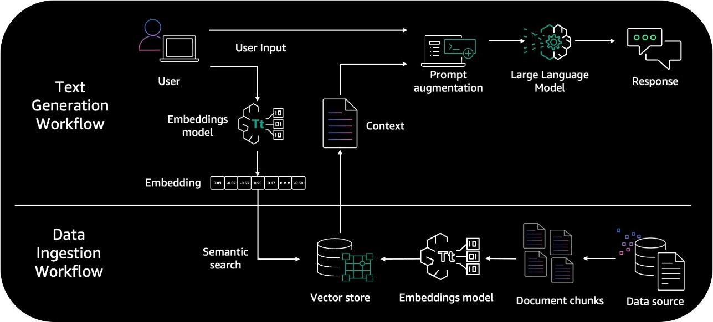

# Semana 1 - LLM Zoomcamp

Este documento recopila mis apuntes y recursos para la **Semana 1** del curso LLM Zoomcamp.

## 📝 Notas de la teoría

### Large Language Model (LLM)

Un LLM (Large Language Model) es un modelo de lenguaje basado en redes neuronales profundas, entrenado para predecir el siguiente token (una palabra, parte de una palabra o símbolo) en una secuencia de texto. A partir de grandes volúmenes de datos textuales, aprende patrones sintácticos, semánticos y contextuales, lo que le permite generar respuestas coherentes, relevantes y con apariencia humana.

Los LLM más avanzados están compuestos por miles de millones o incluso billones de parámetros. Estos parámetros —los pesos de la red neuronal— representan el conocimiento adquirido durante el entrenamiento.

El rendimiento de un LLM depende en gran medida de tres factores:
* La cantidad y diversidad del corpus de entrenamiento
* La escala del modelo (número de parámetros)
* Y su arquitectura, siendo el Transformer la base de los modelos modernos.

**¿Cómo predice tokens un LLM?**
1. Se introduce un prompt o secuencia inicial de texto.
2. El modelo calcula la probabilidad de cada posible token que podría continuar la secuencia.
3. Se selecciona el token más probable (o uno entre los más probables, usando técnicas como muestreo o top-k).
4. El token elegido se agrega al texto y el proceso se repite hasta completar la respuesta.

### Retrieval-Augmented Generation (RAG)

En el ámbito de los Modelos de Lenguaje Grandes (LLMs), una de las limitaciones recurrentes ha sido su tendencia a "alucinar" o generar información incorrecta o no verificable. Aunque los LLMs son increíblemente potentes para comprender y generar texto, su conocimiento se limita a los datos con los que fueron entrenados. Aquí es donde entra en juego **RAG (Retrieval-Augmented Generation)**, una técnica que busca solucionar esta deficiencia, permitiendo a los LLMs acceder a fuentes de información externas y verificables en tiempo real, mejorando significativamente la precisión y relevancia de sus respuestas.

La idea central de RAG es combinar la capacidad generativa de un LLM con la capacidad de recuperación de información de un sistema de búsqueda. En lugar de generar una respuesta basándose únicamente en su entrenamiento interno, un modelo RAG primero busca y recupera documentos o pasajes relevantes de una base de datos externa, que puede ser tan vasta como se desee (documentación interna de una empresa, una base de conocimientos, artículos científicos, etc.).

El proceso se desarrolla en dos fases principales. Primero, cuando un usuario plantea una pregunta o una consulta, esta se utiliza para buscar información en la base de datos externa. Esta búsqueda se realiza típicamente utilizando técnicas de incrustación (embeddings) que transforman el texto de la consulta y los documentos en vectores numéricos, permitiendo medir la similitud semántica. Los documentos más relevantes se recuperan para la siguiente etapa.

En la segunda fase, la información recuperada, junto con la consulta original del usuario, se alimenta al LLM. El LLM entonces utiliza este contexto adicional, que es fidedigno y específico, para generar su respuesta. Este enfoque permite que el modelo genere respuestas más precisas, fundamentadas en hechos y adaptadas a la información más reciente o específica que no estaba presente en sus datos de entrenamiento iniciales.

La principal ventaja de RAG es que reduce drásticamente las alucinaciones y permite que los LLMs respondan preguntas sobre información muy específica o datos que no existían en el momento de su entrenamiento. Es una solución ideal para aplicaciones que requieren alta precisión y verificabilidad, como chatbots corporativos, asistentes de soporte técnico o sistemas de preguntas y respuestas basados en bases de conocimientos. Además, al no requerir un reentrenamiento completo del LLM cada vez que se actualiza la base de conocimientos, RAG ofrece una solución más eficiente y escalable para mantener los LLMs actualizados y relevantes.

En resumen, RAG transforma los LLMs de ser meros generadores de texto basados en su memoria de entrenamiento a convertirse en potentes "investigadores" capaces de consultar y sintetizar información externa, brindando respuestas más ricas, precisas y confiables. Es un paso crucial hacia LLMs verdaderamente informados y útiles en una amplia variedad de aplicaciones.



## 🛠️ Ejemplo práctico de RAG (Retrieval-Augmented Generation

### Creación de un entorno de desarrollo

Para crear y gestionar el entorno de Python de este proyecto se utiliza `uv`, una herramienta moderna que combina gestión de entornos virtuales y resolución de dependencias de forma rápida y eficiente.

Este enfoque reemplaza el uso tradicional de herramientas como `venv`, `pip` y `virtualenv`, ofreciendo una experiencia más simple y veloz.

ℹ️ Para más detalles sobre cómo instalar y utilizar uv, consulta el archivo [`working-with-uv.md`](../docs/working-with-uv.md)

Una vez instalado `uv`, puedes crear el entorno virtual e instalar todas las dependencias necesarias con un solo comando:

```bash
uv venv && uv sync
```

Esto creará un entorno virtual en el directorio del proyecto y sincronizará las librerías especificadas en el archivo `pyproject.toml`.

### Cómo crear una cuenta en OpenAI y configurar tu API Key para usarla con Python

#### 1. Crear una cuenta en OpenAI
- Ingresá a https://platform.openai.com/signup
- Registrate usando una cuenta de Google, Microsoft o un correo electrónico.
- Verificá tu identidad mediante número de teléfono (es obligatorio).
- Una vez dentro, accedé al Dashboard de OpenAI

#### 2. Obtener tu API Key
- En el dashboard, hacé clic en "API keys" desde el menú izquierdo.
- Presioná "Create new secret key".
- Copiá la API Key generada (se muestra una sola vez). Guardala en un lugar seguro.

#### 3. Configurar la API Key como variable de entorno
En tu terminal (válido solo mientras la terminal esté abierta)

```bash
export OPENAI_API_KEY=tu_api_key_aqui
```

⚠️ No incluyas tu API key directamente en el código si vas a subirlo a un repositorio o compartirlo.

#### 4. Instalar la libreria necesaria
Instalá la librería oficial de OpenAI:

```bash
uv add openai
# o
pip install openai
```

Con estos pasos, estás listo para comenzar a interactuar con los modelos de OpenAI de manera segura y flexible desde Python.

### Código Python que muestra cómo usar un LLM con una base de conocimiento externa (RAG)

Si querés ver un ejemplo práctico de cómo implementar RAG (Retrieval-Augmented Generation) utilizando OpenAI o Gemini y una base de conocimiento local, podés consultar el archivo [`llm_api_examples_gemini_openai`](./notebook/llm_api_examples_gemini_openai.ipynb)

Este notebook incluye ejemplos de cómo:
- Hacer una consulta simple a un modelo LLM (como GPT o Gemini).
- Conectar ese modelo a una fuente externa de datos (como un documento o colección de texto).
- Combinar recuperación de información y generación de texto para responder preguntas con base en conocimiento personalizado.

## 🔗 Lectura recomendada
Recomendado para profundizar en los conceptos clave y ampliar tu comprensión
* [Del prompt a la respuesta: el poder de los Large Language Models](https://medium.com/@j92riquelme/del-prompt-a-la-respuesta-el-poder-de-los-large-language-models-b4a28663fed9)
* [¿Qué son los modelos de lenguaje de grandes (LLM)?](https://azure.microsoft.com/es-es/resources/cloud-computing-dictionary/what-are-large-language-models-llms)
* [Introduction to Large Language Models](https://developers.google.com/machine-learning/resources/intro-llms)
* [¿Cómo lograr que una IA responda con precisión sobre mis propios documentos? Conocé RAG (Retrieval-Augmented Generation)](https://medium.com/@j92riquelme/cómo-lograr-que-una-ia-responda-con-precisión-sobre-mis-propios-documentos-e7959a816cef)
* [¿Qué es la generación aumentada por recuperación o RAG?](https://www.redhat.com/es/topics/ai/what-is-retrieval-augmented-generation?gad_source=1&gad_campaignid=22501758914&gbraid=0AAAAADsbVMTiqBq3YrdPWxHpN5RJa_5aL&gclid=CjwKCAjwl_XBBhAUEiwAWK2hzkNLesvpeuFH1oXLAuzgvPRbeY6Cf9pQ95r2zDw8ag-cCyKsUXdDghoCklcQAvD_BwE)
* [¿Qué es la RAG (generación aumentada por recuperación)?](https://aws.amazon.com/es/what-is/retrieval-augmented-generation/)
* [¿Qué es la generación mejorada por recuperación (RAG)?](https://cloud.google.com/use-cases/retrieval-augmented-generation?hl=es_419)
* [Retrieval Augmented Generation (RAG) for LLMs](https://www.promptingguide.ai/research/rag)
* [Advanced RAG: Architecture, techniques, applications and use cases and development](https://www.leewayhertz.com/advanced-rag/)
* [Modelos de Lenguaje Extensos y Prompts](https://medium.com/@j92riquelme/modelos-de-lenguaje-extensos-y-prompts-339082864872)
* [OpenAI - Developer quickstart](https://platform.openai.com/docs/quickstart?api-mode=responses&lang=python)
* [API de Gemini Developer](https://ai.google.dev/gemini-api/docs?hl=es-419)
* [“Attention is All You Need”: La chispa que encendió la revolución de la IA Generativa](https://medium.com/@j92riquelme/attention-is-all-you-need-la-chispa-que-encendi%C3%B3-la-revoluci%C3%B3n-de-la-ia-generativa-5c987353039b)
* [ReACT Agent Model](https://klu.ai/glossary/react-agent-model)
* [What is a ReAct agent?](https://www.ibm.com/think/topics/react-agent)
* [El ciclo de vida de un proyecto de IA: de la idea a la implementación](https://medium.com/@j92riquelme/el-ciclo-de-vida-de-un-proyecto-de-ia-de-la-idea-a-la-implementación-bae6794121f3)
* [Prompt engineering is the new feature engineering](https://www.amazon.science/blog/emnlp-prompt-engineering-is-the-new-feature-engineering)
* [Few-shot learning in practice: GPT-Neo and the Accelerated Inference API](https://huggingface.co/blog/few-shot-learning-gpt-neo-and-inference-api)
* [Zero-shot prompting for the Flan-T5 foundation model in Amazon SageMaker JumpStart](https://aws.amazon.com/blogs/machine-learning/zero-shot-prompting-for-the-flan-t5-foundation-model-in-amazon-sagemaker-jumpstart)

## ▶️ Videos recomendados
Selección de videos para reforzar visualmente los temas abordados
* [Introducción a la IA generativa](https://www.youtube.com/watch?v=tNBvUvsScAA&t=1s)
* [Introducción a los modelos de lenguaje grandes](https://www.youtube.com/watch?v=Vi0ODh3ncxw&t=3s)
* [Introduction to Responsible AI](https://www.youtube.com/watch?v=JbluXe6QpxM&t=4s)
* [MIT 6.S191 (Google): Modelos de lenguaje grandes](https://www.youtube.com/watch?v=ZNodOsz94cc)


## 📚 Cursos adicionales recomendados
Recursos complementarios para seguir aprendiendo y fortaleciendo tus habilidades.

* [Introduction to Generative AI Learning Path](https://www.cloudskillsboost.google/paths/118)
* [ChatGPT Prompt Engineering for Developers](https://www.deeplearning.ai/short-courses/chatgpt-prompt-engineering-for-developers/)

---

> 📌 **Nota:** este repositorio complementa el curso **LLM Zoomcamp** de [DataTalks.Club](https://datatalks.club/), y contiene notas, lecturas, videos, ejemplos y recursos adicionales.  
> Para acceder al contenido oficial del curso, visita el [**repositorio principal en GitHub**](https://github.com/DataTalksClub/llm-zoomcamp).
