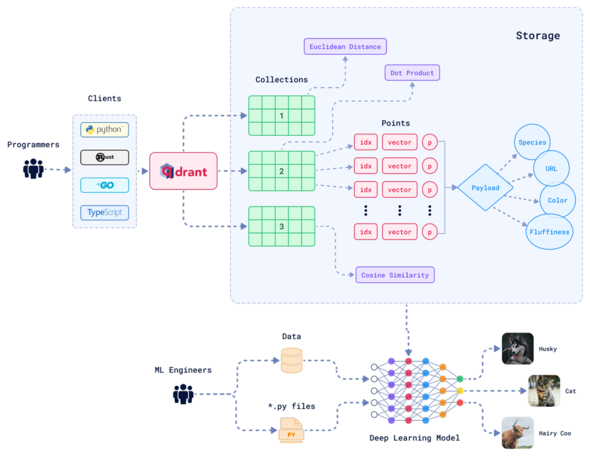
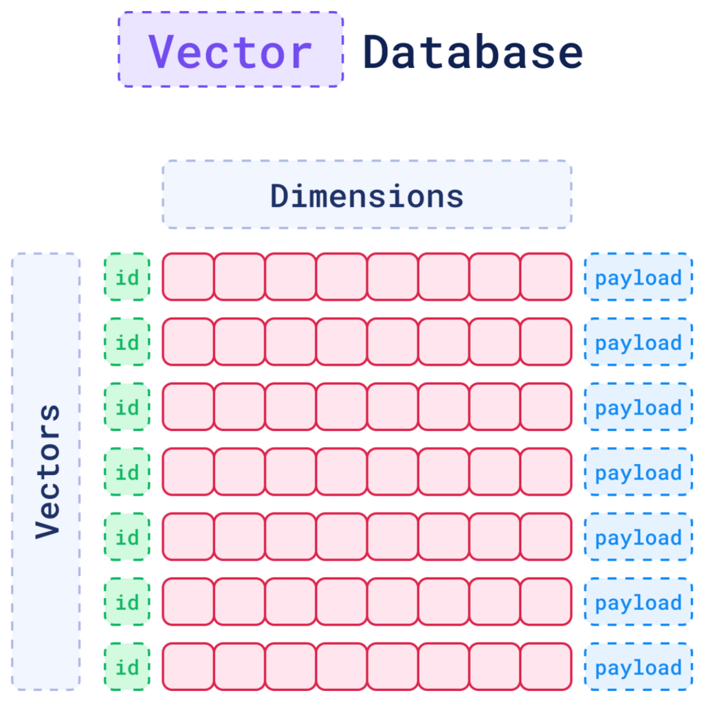

# Semana 2 - LLM Zoomcamp

Este documento recopila mis apuntes y recursos para la **Semana 2** del curso LLM Zoomcamp.

## 📝 Notas de la teoría

### Busqueda Vectorial

La búsqueda vectorial permite encontrar objetos similares transformándolos en vectores de alta dimensión y comparándolos en función de su cercanía en ese espacio. Qdrant es una base de datos open‑source escrita en Rust, diseñada para realizar esa búsqueda de manera rápida y escalable

**Vectores**

En aprendizaje automático, un vector es una representación numérica de un objeto complejo (texto, imagen, usuario, etc.) en un espacio multidimensional. Si imaginas cada dato como una canción, el vector sería la partitura que resume su melodía semántica.

**Métricas de similitud**

Comparar vectores es medir distancias:
- Similitud del coseno: compara la orientación de dos vectores (ángulo).
- Distancia Euclidiana: mide la distancia “directa” en el espacio.
- Producto escalar: correlaciona vectores en función de su producto escalar.

**Búsqueda semántica y disimilitud**

- Búsqueda de similitud semántica: encuentra vectores cercanos al vector de consulta, como buscar estrellas de la misma constelación.
- Búsqueda por disimilitud: selecciona vectores lejanos, útil para detección de anomalías.

**Búsqueda de diversidad**

Algunos casos requieren variedad. Una manera sería filtrar resultados muy cercanos entre sí (“vecinos ruidosos”), garantizando que los resultados sean semánticamente distintos entre sí.


**Recomendaciones basadas en vectores**
* Recomendaciones de características vectoriales: almacenamos vectores de usuarios y productos. Luego, al comparar vectores similares, sugerimos ítems que están cerca en ese espacio.

* Recomendaciones de distancia relativa: no se trata solo de encontrar los más similares, sino de medir "lo suficientemente cerca" respecto al promedio, usando filtros dinámicos y normalización dentro del espacio vectorial.

**Descubrimiento**

Encuentros inesperados son posibles gracias a la diversidad vectorial: descubrir relaciones no evidentes entre documentos, temas o productos.

### Qdrant: Motor de Búsqueda Vectorial Semántica

Qdrant (Quadrant) es un **motor de base de datos vectorial de alto rendimiento** diseñado para búsquedas semánticas, recuperación de información por similitud y aplicaciones de inteligencia artificial. Está optimizado para manejar **incrustaciones vectoriales** generadas por modelos de machine learning y proporciona una API eficiente para realizar búsquedas de vecinos más cercanos (k-NN) de manera precisa, rápida y escalable.

Qdrant permite almacenar vectores densos (embeddings) junto con **metadatos** estructurados, habilitando búsquedas híbridas: **vectoriales** (por similitud semántica) y **filtradas** (por condiciones estructuradas). Es ideal para aplicaciones como:

- RAG (Retrieval-Augmented Generation)
- Recomendadores
- Motores de búsqueda semántica
- Chatbots con contexto vectorial

#### **Características Principales**

- Soporte de vectores de alta dimensión:
- Búsqueda aproximada y exacta (HNSW, Brute Force)
- Filtros por metadatos estructurados
- Indexación incremental y tiempo real
- Optimizado para CPU y disponible con soporte para GPU
- Integración con FastEmbed y frameworks de ML/IA
- Soporta múltiples colecciones y namespaces.
- API REST y gRPC.
- Persistencia en disco o en memoria.

#### **Arquitectura**



- Motor de búsqueda HNSW (Hierarchical Navigable Small World): estructura de grafo eficiente para búsquedas vectoriales aproximadas.
- Gestión de Payloads: cada vector puede tener metadatos adjuntos para filtrado semántico estructurado.
- Shard Manager: cuando se usa en clúster, balancea y distribuye datos entre nodos.

#### **Almacenamiento de Datos: Colecciones y Puntos**

Qdrant organiza los datos en **colecciones**, similares a las tablas en una base de datos relacional. Cada colección agrupa un conjunto de vectores y su información asociada.



*Colección*

Una colección representa un espacio de búsqueda aislado con su propio índice, configuración y datos. Puedes tener múltiples colecciones, por ejemplo: `faq_articles`, `legal_docs` y `product_catalog`

Cada colección define:

- El tamaño de los vectores (dimensionalidad)
- La métrica de similitud (`Cosine`, `Euclidean`, `Dot`)
- Opcionalmente, si usa HNSW u otro tipo de indexado

*Punto*

Los datos dentro de una colección se almacenan como puntos (PointStruct). Cada punto es un objeto que representa un vector en el espacio semántico y contiene:
- `id`: identificador único del punto (entero o UUID)
- `vector`: array de floats (el embedding)
- `payload`: diccionario de metadatos JSON asociados al vector

Este diseño permite, realizar búsquedas vectoriales por similitud sobre `vector` y filtrar por metadatos estructurados contenidos en `payload`

Los `puntos` se pueden insertar individualmente o por lotes (`batch upsert`) usando la API o el cliente oficial (`qdrant-client` para Python).

*Indexación*

Una vez insertados, los puntos pueden ser indexados automáticamente por el motor HNSW (si está habilitado) o buscados mediante fuerza bruta (Brute Force) si no hay índice disponible. Los índices permiten acelerar la búsqueda de vectores similares sin recorrer todos los datos.

#### **Funcionalidades Clave**

- `search`: buscar por similitud vectorial.
- `recommend`: sugerencias basadas en vectores positivos y negativos.
- `scroll`: recuperación paginada.
- `filter`: búsquedas filtradas por metadatos (ej. categoría, fecha).
- `payload`: adjuntar información extra (JSON) a los vectores.
- `update/delete`: modificaciones en tiempo real.
- `collections`: múltiples espacios de trabajo aislados.
- `snapshots/backups`: gestión de respaldo y restauración.

#### **Seguridad**

- Autenticación basada en tokens (a partir de la versión 1.5).
- Control de acceso a endpoints vía configuración de API keys.
- Comunicaciones seguras mediante TLS (cuando se usa proxy o configuración externa).
- Integrable con firewalls, proxies y servicios de autenticación externos.

#### **Alta Disponibilidad y Redundancia**

- Modo Clúster (Enterprise o Community):
    - Distribución horizontal de shards en múltiples nodos.
    - Replicación de shards para tolerancia a fallos.
    - Rebalanceo automático ante cambios de topología.
- Backups y snapshots periódicos para recuperación de desastres.
- Qdrant Cloud ofrece despliegue gestionado con SLA, HA y escalado automático.

#### **Tipos de Búsqueda en Qdrant**

Qdrant permite realizar búsquedas inteligentes sobre contenido no estructurado como texto, imágenes o audio. A través de incrustaciones (embeddings), Qdrant transforma los datos en vectores semánticos y permite realizar distintos tipos de búsqueda adaptados al caso de uso.

A continuación, se explican los enfoques más comunes:

#### 1. Búsqueda Semántica (Semantic Search)

**¿Qué es?**

La búsqueda semántica recupera información basada en **el significado** de los datos, en lugar de buscar coincidencias exactas de palabras.

**¿Cómo funciona?**

- Se convierte la consulta del usuario en un vector utilizando el mismo modelo de incrustación que se usó para indexar los documentos.
- Se calcula la **similitud** entre este vector de consulta y los vectores ya almacenados en Qdrant (usualmente mediante **similitud de coseno**).
- Se devuelven los documentos cuyos vectores están más cercanos en el espacio semántico.

**¿Cuándo usarla?**

- Cuando es importante recuperar resultados que expresen **la misma idea aunque usen palabras distintas**.
- Casos como: FAQ, sistemas RAG, recuperación de contexto para LLMs, motores de búsqueda inteligentes.

#### 2. Búsqueda Exacta (Exact Match Search)

**¿Qué es?**

Es una búsqueda basada en **coincidencias exactas** de valores en campos estructurados (metadatos), similar a filtros SQL.

**¿Cómo funciona?**

- No utiliza vectores ni similitud semántica.
- Se realiza un filtrado directo por valores específicos en el payload (metadatos) de los documentos.
- Ejemplo: `idioma = "es"` o `categoria = "legal"`.

**¿Cuándo usarla?**

- Para filtrar por propiedades exactas antes de una búsqueda semántica.
- En sistemas donde ciertos criterios (fecha, idioma, tipo, etc.) son obligatorios.
- También se puede usar sola, cuando no se requiere inferencia semántica.

**Ventajas**

- Muy eficiente y determinista. Se comporta como una base de datos estructurada tradicional.

#### 3. Búsqueda Exacta con BM25 (BM25 Sparse Text Search)

**¿Qué es?**

Es una técnica de recuperación de información basada en el modelo estadístico **BM25**, el cual calcula la relevancia de los documentos respecto a una consulta textual exacta. Utiliza vectores **dispersos** que representan la presencia y frecuencia de palabras, sin aplicar modelos de lenguaje ni embeddings semánticos.

**¿Cómo funciona?**

- Se tokenizan los textos (documentos y consulta) y se construyen vectores dispersos usando TF-IDF o BM25.
- BM25 evalúa la relevancia en función de:
  - Frecuencia de cada término en el documento (TF).
  - Qué tan informativo es el término en el corpus (IDF).
  - Longitud del documento (penaliza documentos muy largos).
- Los documentos se ordenan por su **puntuación BM25** y se devuelven los más relevantes.

**Ventajas**

- Requiere pocos recursos (no necesita modelos preentrenados).
- Captura con precisión los términos **literalmente coincidentes** que son significativos.
- Es **rápida y eficaz** para textos cortos o consultas específicas.

**Limitaciones**

- No reconoce sinónimos, intenciones ni contexto semántico.
- Es sensible a errores ortográficos y variaciones de redacción.
- Requiere un buen preprocesamiento textual (idioma, stopwords, etc.).

**Casos de uso**

- Consultas con **palabras clave técnicas o exactas** (ej. errores, productos, cláusulas legales).
- Documentación donde el lenguaje exacto es importante (ej. bases de conocimiento).
- Complemento a búsquedas semánticas en esquemas híbridos (textual + vectorial).

#### 4. Búsqueda Multi-Stage (Multi-stage Search)

**¿Qué es?**

Es una técnica en la que se encadenan varias etapas de búsqueda o filtrado para **refinar progresivamente** los resultados.

**¿Cómo funciona?**

1. **Etapa 1**: Se aplica una búsqueda o filtro inicial (por ejemplo, una búsqueda exacta o un filtro por metadatos).
2. **Etapa 2**: Sobre los resultados obtenidos, se realiza una búsqueda vectorial más precisa o costosa.
3. **Opcionalmente**, se puede agregar una tercera etapa con re-ranking (reordenamiento por algún criterio adicional).

**¿Cuándo usarla?**

- Cuando el volumen de datos es grande y se quiere **acotar primero** por criterios estructurados.
- Cuando se necesita una **combinación jerárquica de criterios**, como idioma → categoría → semántica.

**Ventajas**

- Reduce el costo computacional de comparar todos los vectores.
- Permite una búsqueda escalable y precisa.

#### 5. Búsqueda Híbrida (Hybrid Search)

**¿Qué es?**

Combina **búsqueda exacta basada en texto** (BM25, keyword matching) con **búsqueda vectorial semántica**, devolviendo un resultado mixto ordenado por relevancia total.

**¿Cómo funciona?**

- Se ejecutan en paralelo una búsqueda textual exacta y una búsqueda semántica.
- Se combinan ambas puntuaciones (por ejemplo, con pesos personalizados) para determinar el ranking final de resultados.

**¿Cuándo usarla?**

- Cuando los usuarios mezclan **palabras clave técnicas y lenguaje natural**.
- En casos donde se requiere precisión con términos específicos (ej. códigos de error, identificadores).

**Ejemplo:**

Buscar “¿cómo funciona la cláusula penal 101-B?” puede beneficiarse de:
- Coincidencia exacta con “101-B” (keyword)
- Búsqueda semántica sobre “cómo funciona la cláusula penal”

#### 6.Otros tipos de búsqueda (avanzados)

Qdrant también permite, directamente o mediante integración, implementar búsquedas más avanzadas:

- **Búsqueda personalizada por usuario** (personalización mediante vectores contextuales).
- **Búsqueda con feedback negativo/positivo** (ej. “parecido a A, pero no como B”).
- **Re-ranking basado en LLMs** (aplicar un modelo adicional para reordenar).
- **Búsqueda multimodal** (comparar texto con imágenes, audio, etc.).
- **Búsqueda por distancia geográfica combinada con semántica** (geo + vectores).

Estos enfoques son ideales para sistemas de recomendación, motores de búsqueda híbridos complejos o entornos de producción avanzados.


## 🛠️ Ejemplo práctico de Qdrant

### Creación de un entorno de desarrollo

Para crear y gestionar el entorno de Python de este proyecto se utiliza `uv`, una herramienta moderna que combina la gestión de entornos virtuales y la resolución de dependencias de forma rápida y eficiente.

Este enfoque reemplaza el uso tradicional de herramientas como `venv`, `pip` y `virtualenv`, ofreciendo una experiencia más simple y ágil.

ℹ️ Para más detalles sobre cómo instalar y utilizar uv, consulta el archivo [`working-with-uv.md`](../docs/working-with-uv.md)

Una vez instalado `uv`, puedes crear el entorno virtual e instalar todas las dependencias necesarias con un solo comando:

```bash
uv venv && uv sync
```

Este comando creará un entorno virtual en el directorio del proyecto y sincronizará las librerías especificadas en el archivo `pyproject.toml`.

### Interactuando con Qdrant usando Python

#### **1. Descargar la imagen de Qdrant desde Docker Hub**

```bash
docker pull qdrant/qdrant
```

#### **2. Ejecutar el servicio**

```bash
docker run -p 6333:6333 -p 6334:6334 \
    -v "$(pwd)/qdrant_storage:/qdrant/storage:z" \
    qdrant/qdrant
```

Con esta configuración predeterminada, todos los datos se almacenarán en el directorio  `./qdrant_storage`, el cual será accesible tanto para el contenedor como para el host.

Qdrant ahora estará disponible en:
- API REST: http://localhost:6333
- Interfaz web: http://localhost:6333/dashboard
- API gRPC: http://localhost:6334

#### **3. Flujo básico**

Si deseas ver un ejemplo práctico de cómo crear una colección, agregar elementos y realizar una consulta, puedes consultar el archivo [`0_quickstart`](./notebook/0_quickstart.ipynb).

Este notebook incluye ejemplos de:
- Creación de un cliente.
- Creación de una colección.
- Inserción de puntos/vectores en una colección.
- Recuperación de los puntos/vectores más cercanos.
- Aplicación de filtros en las búsquedas.

#### **4. Generación de incrustaciones (embeddings) con FastEmbed**

Si deseas ver un ejemplo práctico de cómo generar incrustaciones de texto utilizando la librería `FastEmbed`, puedes consultar el archivo [`1_fastembed_embeddings`](./notebook/1_fastembed_embeddings.ipynb).

Este notebook incluye ejemplos de:
- Instalación y carga del modelo de incrustación (`BAAI/bge-small-en-v1.5`, entre otros).
- Transformación de textos en vectores numéricos (embeddings).
- Visualización de las incrustaciones generadas.
- Preparación de los vectores para su posterior indexación en una colección de Qdrant.

#### **5. Búsqueda semántica con Qdrant**

Si deseas ver un ejemplo práctico de cómo realizar una búsqueda semántica utilizando Qdrant, puedes consultar el archivo [`2_sematic_search.ipynb`](./notebook/2_sematic_search.ipynb).

Este notebook incluye ejemplos de:
- Creación de una colección en Qdrant para búsqueda semántica.
- Inserción de vectores densos generados previamente.
- Ejecución de búsquedas basadas en similitud semántica.
- Interpretación de los resultados obtenidos en consultas de lenguaje natural.

#### **6. Construcción de un sistema RAG con Qdrant**

Si deseas ver cómo construir un sistema RAG (Retrieval-Augmented Generation) básico, puedes consultar el archivo [`3_rag_and_qdrant.ipynb`](./notebook/3_rag_and_qdrant.ipynb).

Este notebook incluye ejemplos de:
- Indexación de documentos con metadatos relevantes.
- Implementación de un flujo de recuperación y generación con OpenAI.
- Uso de Qdrant como backend para la recuperación semántica.
- Generación de respuestas fundamentadas en los documentos cargados.


#### **7. Búsqueda híbrida: combinación de vectores densos y dispersos**

Si deseas ver cómo realizar una búsqueda híbrida combinando embeddings densos y vectores dispersos (como BM25), puedes consultar el archivo [`4_hybrid_search.ipynb`](./notebook/4_hybrid_search.ipynb).

Este notebook incluye ejemplos de:
- Configuración de una colección híbrida en Qdrant.
- Inserción de puntos con vectores densos y texto para vectorización dispersa.
- Ejecución de búsquedas híbridas con fusión de puntuaciones.
- Comparación entre resultados semánticos, léxicos e híbridos.


## 🔗 Lectura recomendada
Recomendado para profundizar en los conceptos clave y ampliar tu comprensión
* [What is Qdrant?](https://qdrant.tech/documentation/overview/)
* [How Does Vector Search Work in Qdrant?](https://qdrant.tech/documentation/overview/vector-search/)
* [How to Get Started with Qdrant Locally](https://qdrant.tech/documentation/quickstart/)
* [Built for Vector Search](https://qdrant.tech/articles/dedicated-vector-search/)
* [Qdrant Web UI](https://qdrant.tech/documentation/web-ui/)
* [How to Generate Text Embedings with FastEmbed](https://qdrant.tech/documentation/fastembed/fastembed-quickstart/)
* [Using FastEmbed with Qdrant for Vector Search](https://qdrant.tech/documentation/fastembed/fastembed-semantic-search/)
* [Qdrant - Concepts](https://qdrant.tech/documentation/concepts/)
* [An Introduction to Vector Databases](https://qdrant.tech/articles/what-is-a-vector-database/)
* [Build Your First Semantic Search Engine](https://qdrant.tech/documentation/beginner-tutorials/search-beginners/)
* [A Complete Guide to Filtering in Vector Search](https://qdrant.tech/articles/vector-search-filtering/)
* [Hybrid Search Revamped - Building with Qdrant's Query API](https://qdrant.tech/articles/hybrid-search/)
* [Estrellas en el cielo semántico: búsqueda vectorial con Qdrant](https://medium.com/@j92riquelme/estrellas-en-el-cielo-semántico-búsqueda-vectorial-con-qdrant-89072b49f418)
* [Búsqueda vectorial: organización de datos, modelos de incrustación y similitud semántica](https://medium.com/@j92riquelme/búsqueda-vectorial-organización-de-datos-modelos-de-incrustación-y-similitud-semántica-75954ec9b6aa)
* [Mapeando el Universo Semántico con Qdrant: De Vectores a Visualización](https://medium.com/@j92riquelme/mapeando-el-universo-semántico-con-qdrant-de-vectores-a-visualización-9dcfa078a21a)
* [Navegando el Espacio Semántico: Una Guía Técnica para Búsquedas de Similitud y Filtrado con Qdrant](https://medium.com/@j92riquelme/navegando-el-espacio-semántico-una-guía-técnica-para-búsquedas-de-similitud-y-filtrado-con-qdrant-75d1b82cc1e2)
* [Dominando la Búsqueda Híbrida: Una Guía Técnica Profunda sobre Qdrant, Vectores Dispersos y Fusión de Relevancia](https://medium.com/@j92riquelme/dominando-la-busqueda-hibrida-qdrant-vectores-dispersos-y-fusion-f8e82d5afb06)
* [Construyendo un Sistema RAG con Qdrant](https://medium.com/@j92riquelme/construyendo-un-sistema-rag-con-qdrant-a551390b8f30)
* [Del RAG clásico a la búsqueda híbrida con Qdrant](https://medium.com/@j92riquelme/del-rag-clasico-a-la-busqueda-hibrida-con-qdrant-5b8f67a39e86)

## ▶️ Videos recomendados
Selección de videos para reforzar visualmente los temas abordados
* [What is RAG? Building Better LLM Systems with Qdrant](https://www.youtube.com/watch?v=rtIyQPJUd_U)
* [How Vector Search Algorithms Work: An Intro to Qdrant](https://www.youtube.com/watch?v=mXNrhyw4q84)
* [Exploring Qdrant concepts - Collections](https://www.youtube.com/watch?v=0sg7pJo0siU)
* [Qdrant Tutorial - Semantic Search for Beginners](https://www.youtube.com/watch?v=AASiqmtKo54)
* [Getting Started with Qdrant](https://youtu.be/LRcZ9pbGnno?si=0xPf3C9oGpR6BxRz)
* [Chatbot with RAG, using LangChain, OpenAI, and Groq](https://www.youtube.com/watch?v=O60-KuZZeQA)
* [Music Recommendation System with Qdrant Vector Search and Audio Embeddings](https://www.youtube.com/watch?v=id5ql-Abq4Y)
* [How to Build the Ultimate Hybrid Search with Qdrant](https://www.youtube.com/watch?v=LAZOxqzceEU)


## 📚 Cursos adicionales recomendados
Recursos complementarios para seguir aprendiendo y fortaleciendo tus habilidades.

* [Retrieval Optimization: From Tokenization to Vector Quantization](https://www.deeplearning.ai/short-courses/retrieval-optimization-from-tokenization-to-vector-quantization/?utm_campaign=qdrant-launch&utm_medium=qdrant&utm_source=partner-promo)

---

> 📌 **Nota:** este repositorio complementa el curso **LLM Zoomcamp** de [DataTalks.Club](https://datatalks.club/), y contiene notas, lecturas, videos, ejemplos y recursos adicionales.  
> Para acceder al contenido oficial del curso, visita el [**repositorio principal en GitHub**](https://github.com/DataTalksClub/llm-zoomcamp).
